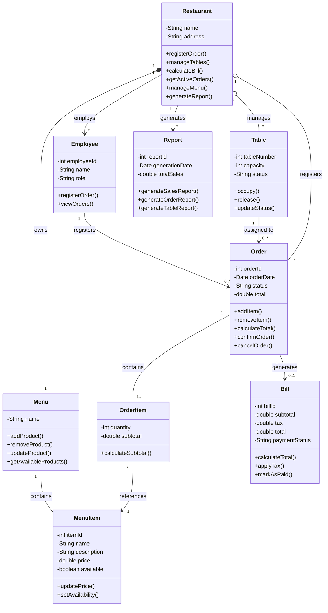

# POO_FinalProject_Orozco_Pe-a

```mermaid
classDiagram
  direction TB
  class Restaurant {
    -String name
    -String address
    +registerOrder()
    +manageTables()
    +calculateBill()
    +getActiveOrders()
    +manageMenu()
    +generateReport()
  }
  
  class Table {
    -int tableNumber
    -int capacity
    -String status
    +occupy()
    +release()
    +updateStatus()
  }
  
  class Order {
    -int orderId
    -Date orderDate
    -String status
    -double total
    +addItem()
    +removeItem()
    +calculateTotal()
    +confirmOrder()
    +cancelOrder()
  }
  
  class OrderItem {
    -int quantity
    -double subtotal
    +calculateSubtotal()
  }
  
  class Menu {
    -String name
    +addProduct()
    +removeProduct()
    +updateProduct()
    +getAvailableProducts()
  }
  
  class MenuItem {
    -int itemId
    -String name
    -String description
    -double price
    -boolean available
    +updatePrice()
    +setAvailability()
  }
  
  class Bill {
    -int billId
    -double subtotal
    -double tax
    -double total
    -String paymentStatus
    +calculateTotal()
    +applyTax()
    +markAsPaid()
  }
  
  class Employee {
    -int employeeId
    -String name
    -String role
    +registerOrder()
    +viewOrders()
  }
  
  class Report {
    -int reportId
    -Date generationDate
    -double totalSales
    +generateSalesReport()
    +generateOrderReport()
    +generateTableReport()
  }
  
  Restaurant "1" o-- "*" Table : manages
  Restaurant "1" *-- "1" Menu : owns
  Restaurant "1" o-- "*" Order : registers
  Restaurant "1" --> "*" Employee : employs
  Restaurant "1" --> "*" Report : generates
  
  Table "1" --> "0..*" Order : assigned to
  Employee "1" --> "0..*" Order : registers
  Order "1" -- "1.." OrderItem : contains
  OrderItem "*" --> "1" MenuItem : references
  Menu "1" -- "" MenuItem : contains
  Order "1" --> "0..1" Bill : generates
```
